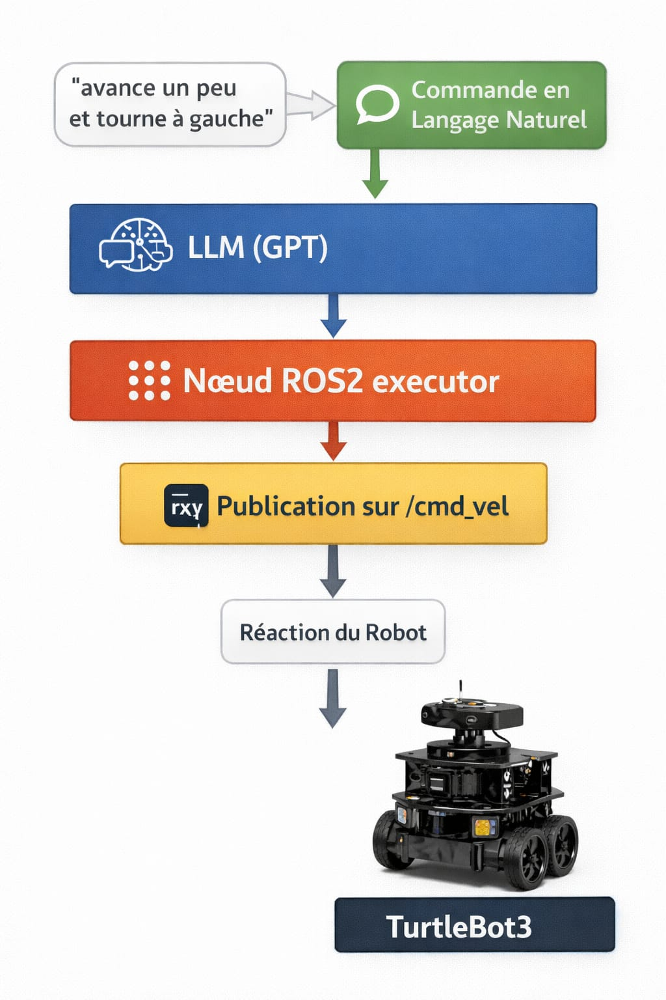

# ROS2 LLM Robot

Un projet de robotique intégrant des modèles de langage (LLM) avec ROS2 pour la prise de décision autonome et l'interaction en langage naturel.

**Dépôt :** https://github.com/thoukam/Ros2-LLM-Robot-Agent.git

## Démo

[](demos/demo_ros2_AI_Agent-speed.mp4)

*Cliquez sur le badge ci-dessus pour voir la vidéo de démonstration du robot en action.*

## Architecture



## Prérequis

- **ROS2** (Humble/Jazzy ou version ultérieure)
- **Python 3.10+**
- **Clé API OpenAI** (pour le modèle GPT-4.1 Mini)
- **TurtleBot3** (Burger, Waffle ou autres variantes)

## Installation

### 1. Créer l'espace de travail
```bash
mkdir -p ~/ros2_ws/src
cd ~/ros2_ws
```

### 2. Cloner les dépôts
```bash
cd src
git clone https://github.com/thoukam/Ros2-LLM-Robot-Agent.git
git clone <robot-executor-url>
```

### 3. Installer les dépendances système
```bash
sudo apt update && sudo apt upgrade
sudo apt install ros-$ROS_DISTRO-turtlebot3*
```

### 4. Configurer l'environnement
```bash
echo "export TURTLEBOT3_MODEL=burger" >> ~/.bashrc
echo "source /opt/ros/$ROS_DISTRO/setup.bash" >> ~/.bashrc
echo "source ~/ros2_ws/install/setup.bash" >> ~/.bashrc
source ~/.bashrc
```

### Définir la clé API OpenAI

Exporter la clé API pour la session en cours :
```bash
export OPENAI_API_KEY="votre-api-key"
```

L'ajouter de façon permanente dans votre `.bashrc` :
```bash
echo 'export OPENAI_API_KEY="votre-api-key"' >> ~/.bashrc
```

Vérifier que la clé est bien définie :
```bash
echo $OPENAI_API_KEY
```

Cela doit renvoyer votre clé API. Sans cela, l'agent LLM ne fonctionnera pas.

### 5. Construire l'espace de travail
```bash
cd ~/ros2_ws
colcon build
```

## Utilisation

### Lancer la simulation TurtleBot3
```bash
ros2 launch turtlebot3_gazebo empty_world.launch.py
```

### Lancer le Robot Executor
```bash
ros2 run robot_executor executor_node
```

Vous devriez voir des sorties similaires à :
```
[INFO] [1772957726.851348456] [robot_executor]: Robot executor started
[INFO] [1772957728.859905908] [robot_executor]: Executing: {'type': 'move_forward', 'distance_m': 0.5}
[INFO] [1772957732.295743440] [robot_executor]: Executing: {'type': 'wait', 'duration_s': 1.0}
[INFO] [1772957733.298416175] [robot_executor]: Executing: {'type': 'turn_left', 'angle_deg': 90}
[INFO] [1772957736.521700830] [robot_executor]: Executing: {'type': 'wait', 'duration_s': 1.0}
[INFO] [1772957737.526129836] [robot_executor]: Executing: {'type': 'stop'}
```

Si le robot ne répond pas pendant ce test, l'agent LLM ne pourra pas le contrôler non plus. Assurez-vous que la simulation et l'executor fonctionnent correctement avant de continuer.

### Lancer l'agent de discussion LLM
```bash
ros2 run robot_agent chat_node
```

## Exemple d'utilisation

Voici une conversation d'exemple montrant les capacités de l'agent robot LLM :

```
[INFO] [1772991670.774448438] [robot_executor]: Robot executor started
Robot chat ready. Type 'quit' to exit.

Vous : salut

Robot : Salut. Je peux discuter avec toi et exécuter des actions simples si tu me le demandes clairement.
Intent: conversation

Vous : ok super, bouge de l'avant voir (de 20 cm)

Robot : D'accord, j'avance de 20 centimètres.
Intent: robot_action
Actions: [{'type': 'move_forward', 'distance_m': 0.2}]

[INFO] [1772991744.923620945] [robot_executor]: Executing: {'type': 'move_forward', 'distance_m': 0.2}

Vous : tu peux retourner à ta position précédente?

Robot : Je peux reculer pour revenir à ma position précédente. Je recule de 20 centimètres.
Intent: robot_action
Actions: [{'type': 'move_backward', 'distance_m': 0.2}]

Vous : ok parfait tu peux encore faire quoi par exemple?

Robot : Je peux avancer, reculer, tourner à gauche ou à droite, m'arrêter, et attendre un certain temps.
Intent: conversation
```

## Architecture du système

Le système suit une architecture en pipeline :

1. Commande en langage naturel - Entrée utilisateur comme "avance un peu et tourne à gauche"
2. Traitement du langage naturel - Commande interprétée par le LLM
3. LLM (GPT) - Traite la commande et génère des actions structurées
4. Nœud ROS2 executor - Traduit les actions en commandes ROS2
5. Publication sur /cmd_vel - Envoie les commandes de vitesse au robot
6. Réaction du robot - Le TurtleBot3 exécute le mouvement