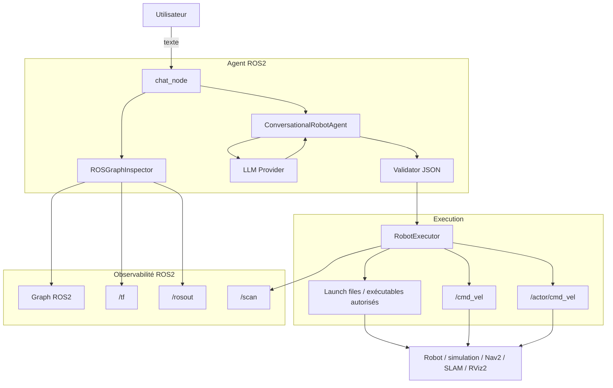

# RosAgent

Agent ROS2 assisté par IA pour l'observabilité, la visualisation et le
diagnostic robot.

L'objectif principal est de gagner du temps : comprendre rapidement l'état du
robot, diagnostiquer les problèmes ROS2, lancer les bonnes briques logicielles
et aider les équipes techniques ou produit à se concentrer sur l'essentiel.

RosAgent peut aussi exécuter quelques actions robot simples, mais le coeur du
projet est l'assistance intelligente autour d'un système robotique : état,
graph ROS2, logs, TF, capteurs, navigation, SLAM, visualisation et debug.

## Capacités

- Observer le graph ROS2 : nœuds, topics, services, publishers/subscribers.
- Résumer l'état robot : disponible, hors ligne, en mouvement, bloqué, occupé.
- Aider au diagnostic : obstacles, topics non connectés, TF incohérents, logs
  `/rosout`, briques déjà actives.
- Lancer et arrêter des briques ROS2 autorisées.
- Éviter les doublons : une brique n'est pas relancée si ses nœuds sont déjà
  présents.
- Contrôler prudemment le robot ou le mannequin via commandes courtes.

## Architecture


```mermaid
flowchart TB
    U[Utilisateur] -->|texte| Chat[chat_node]

    subgraph Agent ROS2
      Chat --> Inspector[ROSGraphInspector]
      Chat --> Agent[ConversationalRobotAgent]
      Agent --> LLM[LLM Provider]
      LLM --> Agent
      Agent --> Validator[Validator JSON]
    end

    subgraph Execution
      Validator --> Executor[RobotExecutor]
      Executor --> CmdVel["/cmd_vel"]
      Executor --> ActorCmd["/actor/cmd_vel"]
      Executor --> Launch["Launch files / exécutables autorisés"]
    end

    subgraph Observabilité ROS2
      Inspector --> Graph[Graph ROS2]
      Inspector --> TF["/tf"]
      Inspector --> Rosout["/rosout"]
      Executor --> Scan["/scan"]
    end

    Launch --> Robot["Robot / simulation / Nav2 / SLAM / RViz2"]
    CmdVel --> Robot
    ActorCmd --> Robot
```

## Prérequis

- ROS2 Humble ou plus récent
- Python 3.10+
- Un fournisseur LLM : Ollama, OpenAI, Claude ou Mistral

## Installation

Depuis le workspace ROS2 :

```bash
cd ~/ros2_ws
colcon build --packages-select robot_executor robot_agent
source install/setup.bash
```

Dépendances Python :

```bash
pip install -r src/Robot_indoor/Ros2-LLM-Robot-Agent/requirements.txt
```

## Configuration LLM

Ollama est utilisé par défaut :

```bash
ollama serve
ollama pull llama3
```

Pour OpenAI :

```bash
export OPENAI_API_KEY="votre-api-key"
```

## Lancement

Démarrer l'agent :

```bash
ros2 run robot_agent chat_node
```

Avec OpenAI :

```bash
ros2 run robot_agent chat_node --ros-args \
  -p llm_provider:=openai \
  -p llm_model:=gpt-4.1-mini
```

## Briques logicielles autorisées

| Demande | Commande exécutée |
|---------|-------------------|
| `Lance le robot` | `ros2 launch robot_indoor view.launch.py` |
| `Lance la cartographie` | `ros2 launch indoor_navigation mapping.launch.py` |
| `Lance nav2` | `ros2 launch nav2_bringup navigation_launch.py` |
| `Lance la navigation indoor` | `ros2 launch indoor_navigation indoor_nav.launch.py` |
| `Lance l'explorateur autonome` | `ros2 launch indoor_navigation frontier_exploration.launch.py` |
| `Ouvre rviz2` | `rviz2` |

Le robot doit être lancé avant `mapping`, `nav2`, `indoor_nav`,
`frontier_exploration` ou `rviz2`. L'agent vérifie la présence de :

```text
robot_state_publisher
parameter_bridge
```

## Arrêt

Exemples :

```text
STOP
Arrête le robot
Arrête nav2
Arrête la cartographie
Arrête l'explorateur autonome
Ferme rviz2
Arrête toutes les briques
```

Les briques lancées par l'agent sont arrêtées proprement : `SIGINT`, puis
`SIGTERM`, puis `SIGKILL` si nécessaire.

Une brique lancée manuellement dans un autre terminal peut être détectée pour
éviter les doublons, mais elle n'est pas tuée automatiquement par l'agent.

## Exemples

```text
Vous : quel est l'état du robot ?
Robot : Le robot semble disponible, /cmd_vel est connecté...

Vous : lance le robot
Robot : D'accord, je lance le robot dans Gazebo.

Vous : lance l'explorateur autonome
Robot : Le robot doit d'abord être lancé. Je démarre le robot...

Vous : avance un peu
Robot : D'accord, j'avance légèrement.
```

## Sécurité

- Sortie LLM obligatoirement validée en JSON.
- Actions et launch files en liste blanche.
- Distances, angles et durées bornés.
- Détection d'obstacles via `/scan`.
- Anti-doublon basé sur les processus lancés et les nœuds ROS2 actifs.
- Logs des briques dans `/tmp/rosagent_launch_*`.

## Validation

Tests ciblés :

```bash
cd ~/ros2_ws/src/Robot_indoor/Ros2-LLM-Robot-Agent
PYTHONPATH=src/robot_agent:src/robot_executor pytest -q \
  src/robot_agent/test/test_validator_software_actions.py \
  src/robot_executor/test/test_software_catalog.py
```

Build ciblé :

```bash
cd ~/ros2_ws
colcon build --packages-select robot_executor robot_agent
```

## Roadmap

- Améliorer le diagnostic automatique à partir de `/rosout`, `/tf`, topics et
  états Nav2.
- Ajouter une vue synthétique pour équipes produit : état mission, cause de
  blocage, prochaines actions recommandées.
- Ajouter des actions Nav2 de haut niveau : objectifs, pause, reprise,
  annulation.
- Mieux suivre les briques lancées hors session agent.
- Ajouter une interface web ou tableau de bord d'observabilité.
- Ajouter des rapports de debug partageables.

## Contribution

Contributions utiles :

- nouveaux diagnostics ROS2 ;
- nouvelles briques en liste blanche ;
- amélioration des prompts ;
- tests sur robots/simulations ;
- UX d'observabilité et visualisation.
