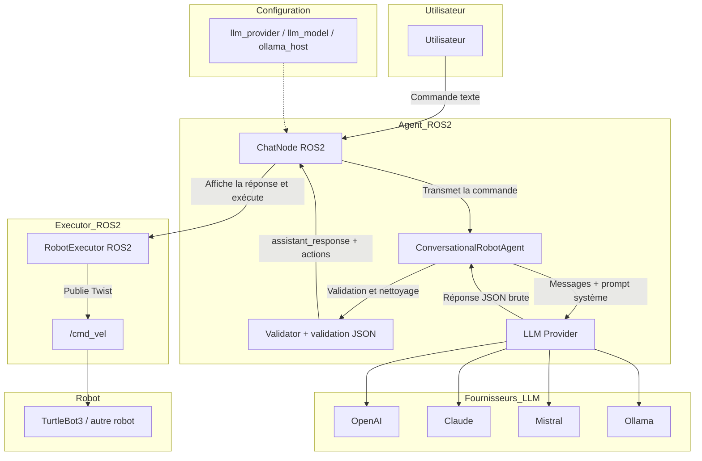
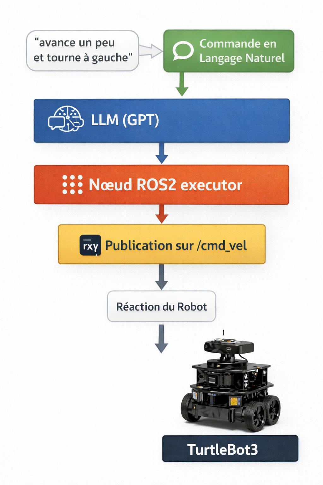

# RosAgent — Agent ROS2 IA pour robotique

> 🤖 Control a robot using natural language with ROS2 + AI agents.

RosAgent est un agent intelligent ROS2 qui transforme des commandes en langage naturel en actions robotisées. Le projet connecte des LLM modernes à TurtleBot3 et à d'autres robots compatibles, en combinant compréhension linguistique, sécurité des actions et exécution ROS2.

**Dépôt :** https://github.com/thoukam/Ros2-LLM-Robot-Agent.git

## 🎥 Démo

[](./demos/demo_ros2_Agent.mp4)


Tests initiaux réalisés avec OpenAI et Ollama. La vidéo de démonstration utilise le modèle OpenAI `gpt-4.1-mini`.

---

## Objectif

Permettre à un utilisateur de donner des commandes simples en français, puis transformer ces commandes en actions structurées exécutées par un nœud ROS2.

### Flux de fonctionnement

1. L’utilisateur envoie une commande en langage naturel.
2. L’agent IA interprète la demande.
3. L’agent génère un plan d’actions JSON.
4. Le nœud ROS2 `robot_executor` exécute ces actions.
5. Le robot agit dans une simulation ou en réel.

---

## Architecture

Le dépôt est structuré en plusieurs composants principaux :

- `robot_agent/` : logique de l’agent, prompts, validation et intégration LLM.
- `robot_executor/` : exécution ROS2 des actions produites par l’agent.
- `llm/` : pilotes et fournisseurs de modèles (OpenAI, Claude, Mistral, Ollama).


### Schéma d’architecture


```mermaid
flowchart TB
    subgraph Utilisateur
      U[Utilisateur]
    end

    subgraph Agent_ROS2
      ChatNode[ChatNode ROS2]
      Agent[ConversationalRobotAgent]
      Validator[Validator + validation JSON]
      LLM[LLM Provider]
    end

    subgraph Executor_ROS2
      Executor[RobotExecutor ROS2]
      CmdVel["/cmd_vel"]
    end

    subgraph Robot
      RobotNode["TurtleBot3 / autre robot"]
    end

    U -->|Commande texte| ChatNode
    ChatNode -->|Transmet la commande| Agent
    Agent -->|Messages + prompt système| LLM
    LLM -->|Réponse JSON brute| Agent
    Agent -->|Validation et nettoyage| Validator
    Validator -->|assistant_response + actions| ChatNode
    ChatNode -->|Affiche la réponse et exécute| Executor
    Executor -->|Publie Twist| CmdVel
    CmdVel --> RobotNode

    subgraph Configuration
      Prov[llm_provider / llm_model / ollama_host]
    end
    Prov -.-> ChatNode

    subgraph Fournisseurs_LLM
      OpenAI[OpenAI]
      Claude[Claude]
      Mistral[Mistral]
      Ollama[Ollama]
    end
    LLM --> OpenAI
    LLM --> Claude
    LLM --> Mistral
    LLM --> Ollama
```

<!--  -->

---

## Prérequis

- ROS2 Humble ou version ultérieure
- Python 3.10+
- TurtleBot3 (Burger, Waffle ou équivalent) (optionnel)
- Un modèle LLM local ou une clé API selon le fournisseur choisi

---

## Fournisseurs LLM supportés

| Fournisseur | Type | Clé requise |
|-------------|------|-------------|
| OpenAI | API | ✅ |
| Claude (Anthropic) | API | ✅ |
| Mistral | API | ✅ |
| Ollama | Local | ❌ |

> Par défaut, le projet recommande **Ollama** pour un fonctionnement local sans API payante.

---

## Installation rapide

### 1. Créer et préparer l’espace de travail

```bash
mkdir -p ~/ros2_ws/src
cd ~/ros2_ws/src
```

### 2. Cloner le dépôt

```bash
git clone https://github.com/thoukam/Ros2-LLM-Robot-Agent.git

```

### 3. Installer les dépendances système

```bash
sudo apt update && sudo apt upgrade
sudo apt install ros-$ROS_DISTRO-turtlebot3*
# Si vous utilisez TurtleBot3 pour tester, sinon utilisez simplement votre robot.
```

### 4. Configurer l’environnement

```bash
echo "export TURTLEBOT3_MODEL=burger" >> ~/.bashrc # si vous utilisez TurtleBot3, sinon pas nécessaire.
echo "source /opt/ros/$ROS_DISTRO/setup.bash" >> ~/.bashrc
echo "source ~/ros2_ws/install/setup.bash" >> ~/.bashrc
source ~/.bashrc
```

### 5. Installer les dépendances Python

```bash
pip install requests
pip install openai anthropic mistralai || true
# ou faites simplement pip install -r requirements.txt pour installer toutes les dépendances
```

### 6. Installer Ollama (recommandé)

```bash
curl -fsSL https://ollama.com/install.sh | sh
ollama pull llama3
```

### 6.1. Dépannage Ollama — connexion interrompue

Si l’installation via script échoue avec une erreur du type :

```bash
curl: (92) HTTP/2 stream 0 was not closed cleanly
tar: Unexpected EOF in archive
```

Cela signifie que le téléchargement a été interrompu.

#### Installation manuelle

```bash
cd /tmp
wget -c https://ollama.com/download/ollama-linux-amd64.tar.zst
# Extraire :
tar --zstd -xf ollama-linux-amd64.tar.zst
sudo rm -f /usr/local/bin/ollama
sudo cp /tmp/bin/ollama /usr/local/bin/ollama
sudo chmod +x /usr/local/bin/ollama
ollama --version
```

#### Lancer Ollama

```bash
ollama serve
```

> Important : démarrez toujours `ollama serve` avant d’exécuter un modèle local.
> RosAgent peut prendre du temps à répondre car Ollama peut être lent sur certaines requêtes.
> La latence peut atteindre 20 secondes ou plus selon le modèle.

Puis dans un autre terminal :

```bash
ollama pull llama3
ollama run llama3
```

> Si vous avez une erreur `cp: not writing through dangling symlink`, c’est qu’un lien cassé existe déjà. La commande suivante le corrige :

```bash
sudo rm /usr/local/bin/ollama
```

---

## Utilisation avec Ollama (machines à faible RAM)

Certaines machines ont peu de mémoire disponible et tous les modèles Ollama ne peuvent pas se charger.

### ⚠️ Erreur courante

```
Error: model requires more system memory than is available
```

Exemple :

```
model requires 3.5 GiB but only 1.3 GiB available
```

Cela signifie que votre machine n’a pas assez de RAM disponible pour charger le modèle.

### Solutions

#### 1. Utiliser un modèle plus léger

Pour les machines avec peu de RAM, utilisez des modèles optimisés :

- Ultra léger (très faible RAM)

```bash
ollama pull tinyllama
ollama run tinyllama
```

ou :

```bash
ollama pull qwen2.5:0.5b
ollama run qwen2.5:0.5b
```

Fonctionne même avec très peu de mémoire
Idéal pour tests et machines limitées

- Léger et plus performant (recommandé)

```bash
ollama pull qwen2.5:1.5b
ollama run qwen2.5:1.5b
```

Bon compromis performance / mémoire
Meilleur que tinyllama pour comprendre les instructions
Recommandé pour RosAgent sur machine limitée

- Moyen

```bash
ollama pull phi3:mini
ollama run phi3:mini
```

Plus performant
Nécessite plus de RAM

- Lourd

```bash
ollama pull llama3
ollama run llama3
```

Très performant
Nécessite beaucoup de RAM

#### Modèles recommandés selon la RAM

| RAM disponible | Modèle recommandé |
|----------------|-------------------|
| < 2GB | `tinyllama` / `qwen2.5:0.5b` |
| 2–4GB | `qwen2.5:1.5b` |
| 4–6GB | `phi3:mini` |
| 6GB+ | `llama3` / `gemma` |

---

## 🔍 Analyse des modèles locaux

Exemple pour `qwen2.5:1.5b` :

- architecture : `qwen2`
- paramètres : `1.5B`
- contexte : `32768` tokens
- quantization : `Q4_K_M`

 `qwen2.5:1.5b` est un très bon compromis pour des tests locaux : léger, compatible avec des machines limitées et plus robuste que les modèles ultra-compact.

### Points importants pour RosAgent

- Ollama est gratuit en local, mais peut être plus complexe à installer que les API cloud.
- Les modèles lourds demandent beaucoup de RAM, donc mieux vaut privilégier `qwen2.5:1.5b` pour des machines modestes.
- Les modèles locaux peuvent être moins stricts que les fournisseurs cloud, donc ils peuvent produire du JSON invalide.

### Compensations dans RosAgent

- prompt structuré strict
- validation JSON (validator)
- fallback en cas d’erreur
- actions limités autorisées

Cela permet d’utiliser un modèle local léger tout en gardant un comportement fiable.

### Recommandation générale

- OpenAI reste recommandé pour la fiabilité, mais il nécessite une API key payante.
- Pour ceux qui ne disposent pas d’API, `qwen2.5:1.5b` est la meilleure option locale pour du testing de compatibilité.

### 7. Construire le workspace

```bash
cd ~/ros2_ws
colcon build
```

---

## Configuration des clés API

### OpenAI

```bash
export OPENAI_API_KEY="votre-api-key"
```

### Claude

```bash
export ANTHROPIC_API_KEY="votre-api-key"
```

### Mistral

```bash
export MISTRAL_API_KEY="votre-api-key"
```

> Ajouter ces variables dans `~/.bashrc` permet une utilisation persistante.

---

## ▶️ Lancement

### 1. Démarrer la simulation

```bash
ros2 launch turtlebot3_gazebo empty_world.launch.py
# si vous utilisez TurtleBot3 bien sûr, sinon lancez votre robot
```

### 2. Démarrer le nœud d'exécution

```bash
ros2 run robot_executor executor_node
# juste pour tester mais pas obligatoire
```

### 3. Démarrer l’agent IA

```bash
ros2 run robot_agent chat_node
```

---

## Sélection du fournisseur LLM

### Ollama (défaut)

```bash
ros2 run robot_agent chat_node --ros-args -p llm_provider:=ollama -p llm_model:=llama3
```

### OpenAI

```bash
ros2 run robot_agent chat_node --ros-args -p llm_provider:=openai -p llm_model:=gpt-4.1-mini
```

### Claude

```bash
ros2 run robot_agent chat_node --ros-args -p llm_provider:=claude -p llm_model:=claude-3-5-sonnet-latest
```

### Mistral

```bash
ros2 run robot_agent chat_node --ros-args -p llm_provider:=mistral -p llm_model:=mistral-small-latest
```

---

## 💬 Exemple de commande

```
Vous : avance un peu
Robot : D'accord, j'avance légèrement.
```

Actions générées possibles :

- `move_forward(0.3)`
- `move_backward(0.3)`
- `turn_left(90)`
- `turn_right(90)`
- `wait(1.0)`
- `stop()`

---

## 🔐 Sécurité et validation

- Liste blanche des actions autorisées
- Validation stricte du JSON produit par le LLM
- Limites sur la distance, l’angle et la durée
- Gestion des erreurs et des retours en cas d’action invalide

---

## 🛠️ Roadmap

Cette feuille de route décrit l'évolution vers un agent robotique intelligent, transparent et capable de piloter des missions complexes.

- Comprendre et exposer l’état du robot en temps réel : offline, online, en mission, disponible, bloqué.
- Fournir un suivi clair et un debug utilisateur : expliquer pourquoi une action est choisie, ce qui a été exécuté et ce qui a échoué.
- Orchestrer plusieurs algorithmes pour accomplir une tâche précise : navigation, SLAM, suivi, planification et supervision.
- Ajuster les paramètres en direct : vitesse, tolérance, objectifs, modes de déplacement et comportement adaptatif.
- Permettre des actions avancées : `navigate_to_pose`, `start_slam`, `path_planning`, `stop`, etc.
- Intégrer la navigation autonome avec Nav2 et des stratégies de déplacement robustes.
- Supporter plusieurs robots en coordination avec un pilote centralisé.
- Connecter l’agent à des interfaces externes : Telegram, Discord, API web, tableau de bord ou interface vocale.
- Fermer la boucle de contrôle avec le feedback capteurs/odométrie pour détecter obstacles et état opérationnel.
- Piloter des missions multi-étapes avec suivi de progression et reprise sur erreur.
- Proposer un auto-debugging intelligent et un diagnostic en continu.

---

## 🤝 Contribution

### Pourquoi contribuer ?

Ce projet explore une nouvelle manière d’interagir avec des robots via des agents IA.
Aujourd’hui, beaucoup d’outils existent séparément : ROS2 pour la robotique et LLM pour le langage naturel.
RosAgent vise à créer un pont entre les deux.

Le projet est encore jeune et ouvert :
- l’architecture peut évoluer
- les usages ne sont pas encore figés
- il y a beaucoup d’expérimentation possible

C’est le bon moment pour contribuer et influencer sa direction.

### État actuel

Le projet est fonctionnel mais en phase d’expérimentation.
Aujourd’hui, il permet :
- de contrôler un robot simple via langage naturel
- d’utiliser plusieurs fournisseurs LLM
- de valider les actions avant exécution

Beaucoup de choses restent à construire et à améliorer.

### Comment contribuer concrètement

#### Agent / LLM
- améliorer le prompt pour les modèles locaux
- rendre le JSON plus robuste
- gérer les erreurs de modèles (Ollama, etc.)

#### Robotique
- ajouter de nouvelles actions (navigation, SLAM, etc.)
- intégrer Nav2
- gérer l’état du robot (disponible, occupé, erreur)

#### Interface
- ajouter Telegram / Discord
- créer une API REST
- créer une interface web

#### Infrastructure
- améliorer la gestion des providers LLM
- ajouter des logs / replay / debug
- travailler sur la sérialisation des actions

#### Expérimentation
- tester différents modèles locaux
- comparer les comportements
- proposer de nouvelles idées d’agent robotique

### Comment démarrer

- ouvrir une issue
- proposer un correctif
- ajouter un provider de modèle
- enrichir les prompts ou les validations
- ajouter des fonctionnalités en lien avec la roadmap

---

## Vision

Construire une couche d’agent IA générique pour la robotique capable de :
- comprendre les instructions humaines
- planifier des actions
- s’adapter à différents robots
- fonctionner localement ou avec des API externes
- effectuer de l'autodébogage et du diagnostic
